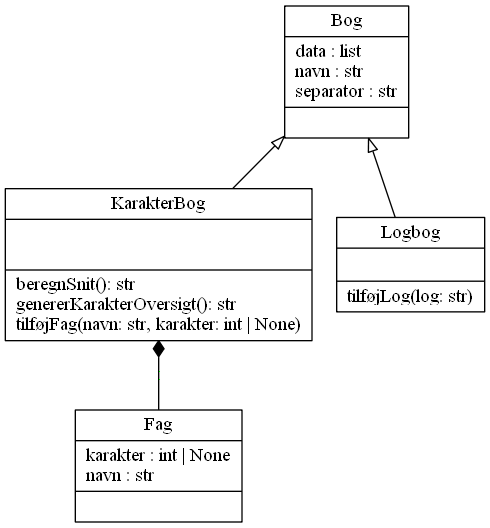

# Polymorfi i Python

[Generel teori om polymorfi](https://jacs-pro.bitbucket.io/Teori/Data/polymorfi.html).

> Samme grænseflade til forskellige datatyper.
> -- systime

Kan opdeles i under kompilering og under programkørsel.
I Python vil der stort set altid være tale om polymorfi under programkørsel.

## Overlæsse

> En funktion som kan anvendes på argumenter af forskellige typer og antal via flere implementeringer
> -- systime [@systimeOverload]

Funktioner kan overlæsses ved at angive et eller flere valgfri parametre i en funktion.

Operatorer overlæsses vha. de indbyggede [metoder for operationer](https://docs.python.org/3/library/operator.html).

- Demo: [overload_karakterbog_OOP.py](demo/overload_karakterbog_OOP.py)

## Generisk funktion

> En funktion som kan anvendes på argumenter af forskellig type via én implementering uden at tage hensyn til specifikke typer.
> -- systime [@systimeGenerisk]

Kræver intet specielt i Python.

- Demo: [overload_karakterbog_OOP.py](demo/overload_karakterbog_OOP.py)

### Øvelser - Overlæsning og generisk funktion

Brug [overload.py](exercises/overload.py) som udgangspunkt.

- Udkommenter koden der implementerer `__add__` og forklar fejlbeskeden ved kørsel.
- Hvilken anden speciel metode er implementeret for klassen `Point`? Hvad bruges den til i kodeeksemplet?
- Udvid koden med overlæsning af subtraktion og/eller negativt fortegn, se [operator module](https://docs.python.org/3/library/operator.html).
- Lav en generisk funktion til at udskrive "Simon says hello" hvor "hello" skal være et funktionsargument af en type der implementerer metoden `__str__`. Afprøv både med et Point, et tal og en tekststreng.

## Nedarvning

I mange sprog er nedarvning et typisk værktøj til at opnå polymorfi.
Konceptet er at en klasse kan nedarve fra en "forælder" hvis det er en mere specifik udgave af forælderen.
Dermed kan fællestræk være defineret for forælderen, mens mere specifikke træk er defineret for børnene [@systimeNedarvning].

Eksempel: Et kvadrat (underklasse) og en trapez (underklasse) **er** begge firkanter (superklasse).

- Demo: [nedarvning_karakterbog_OOP.py](demo/nedarvning_karakterbog_OOP.py)

### Øvelser - Nedarvning

Brug [polymorph_gui.py](exercises/polymorph_gui.py) som udgangspunkt (kræver [pygame](https://www.pygame.org/wiki/GettingStarted)).

- Læs koden og kør den. Forklar (skriv fx ned til logbog) og hvilken klasse der er defineret og hvad den nedarver fra.
- Fjern variablerne `house1` og `house2` og lav i stedet en liste med min. 3 huse. Tegn dem alle vha. en løkke.
- Lav din egen klasse til en simpel geometrisk tegning fx Z til at tegne Zorros tegn. Den skal nedarve fra samme klasse som husene.
- Lav en `sprite.Group` med både huse og dine egne objekter. Tegn dem alle vha. et kald til `draw()` på gruppen.
- Lav en underklasse til `Sprite` kaldet `Shape`.
    - Tilføj en metode i klassen med signaturen `def get_points(self)` som skal returnere alle punkter i figuren.
    - Opdater klassen for huse og din egen metode til at nedarve fra `Shape` i stedet for `Sprite`.
    - Sørg for at metoden `get_points` kun er defineret i `Shape`.
